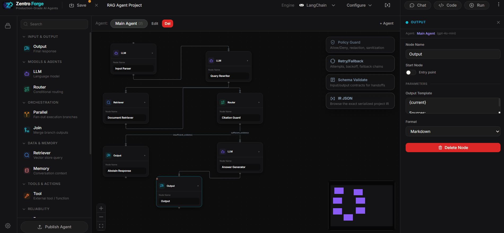

# Zentro Forge

Zentro Forge is a visual agent engineering workbench. It lets you design,
run, evaluate, debug, and export multi-agent systems from a single UI.



## What it does

- Visual flow builder for IR v2 agent systems
- FastAPI backend for flows, runs, replay, evals, exports, credentials, and GitOps
- Runtime timeline, artifacts, replay, and diff tools
- Export pipeline for `langgraph`, `runtime`, `api_server`, and `aws-ecs`
- MCP support with command/tool allowlists

## Repository layout

```text
.
|- backend/              FastAPI backend and tests
|- frontend/             Next.js frontend
|- docs/                 focused project documentation
|- forge_integrations/   copy/paste integration recipes for exported projects
```

## Quickstart

### Prerequisites

- Python `3.11+`
- Node.js `20+`
- npm `10+`

### Install

```bash
git clone <your-repo-url>
cd agent-compiler

cd backend
python -m venv .venv
pip install --upgrade pip
pip install -e ".[dev]"

cd ../frontend
npm ci
```

### Configure

Frontend:

```bash
cd frontend
cp .env.example .env.local
```

Backend environment is read from the process environment. Minimal local setup:

```bash
set AGENT_COMPILER_DEBUG=true
```

Use `export` instead of `set` on macOS/Linux.

Optional for local development:

```bash
set OPENAI_API_KEY=your_key_here
set FORGE_MASTER_KEY=your_fernet_key
```

### Run

Backend:

```bash
cd backend
py -3.11 -m uvicorn agent_compiler.main:app --reload --port 8000
```

Frontend:

```bash
cd frontend
npm run dev
```

### Verify

- Backend health: `http://localhost:8000/health`
- OpenAPI: `http://localhost:8000/docs`
- Frontend: `http://localhost:3000`

## Core concepts

- `IR v2`: the only supported flow payload format
- `Project`: a saved flow instance
- `Run`: one execution of a flow
- `Artifact`: persisted step output used for replay and inspection
- `Export`: generated standalone Python project for a flow
- `Eval suite`: regression checks for a flow

## Documentation

- [Docs Index](docs/README.md)
- [Architecture](docs/ARCHITECTURE.md)
- [API Reference](docs/API.md)
- [Development Guide](docs/DEVELOPMENT.md)
- [Export Targets](docs/export-targets.md)
- [Tools and MCP](docs/tools-and-mcp.md)
- [Runtime Console](docs/RUNTIME_CONSOLE.md)
- [Backend README](backend/README.md)
- [Frontend README](frontend/README.md)
- [Integrations Library](forge_integrations/README.md)

## Security notes

- API auth is optional by default. Set `AGENT_COMPILER_API_KEY` for non-local use.
- Secret encryption depends on `FORGE_MASTER_KEY`.
- MCP can spawn subprocesses. Restrict `AGENT_COMPILER_MCP_ALLOWED_COMMANDS`
  and `AGENT_COMPILER_MCP_ALLOWED_TOOLS` in production.
- The frontend does not implement built-in auth; rely on backend auth for non-local use.

## Limitations

- `POST /projects/{project_id}/regenerate-from-template` currently returns `501`.
- SQLite is the default local store.
- Some production concerns such as full auth/RBAC and multi-tenant isolation are
  out of scope for the current local-first setup.

## License

MIT
